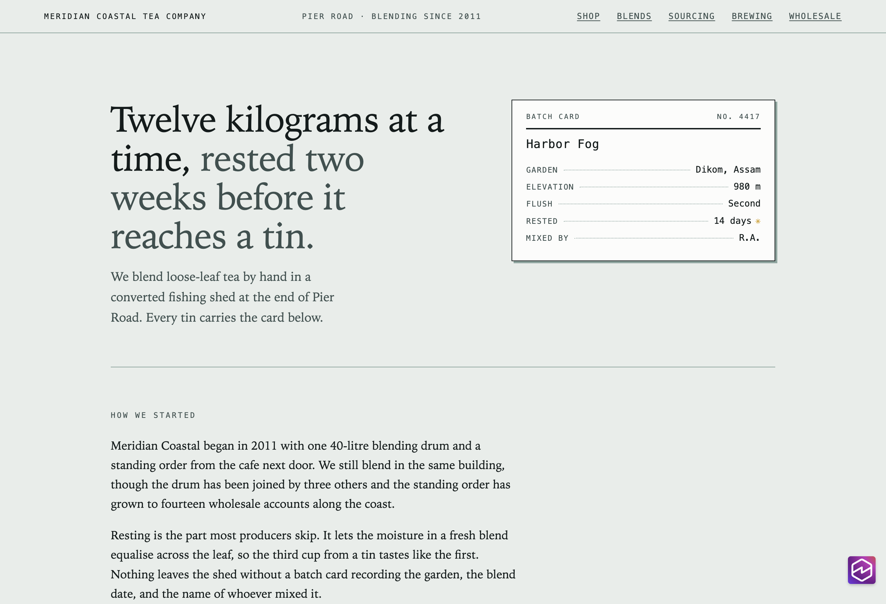
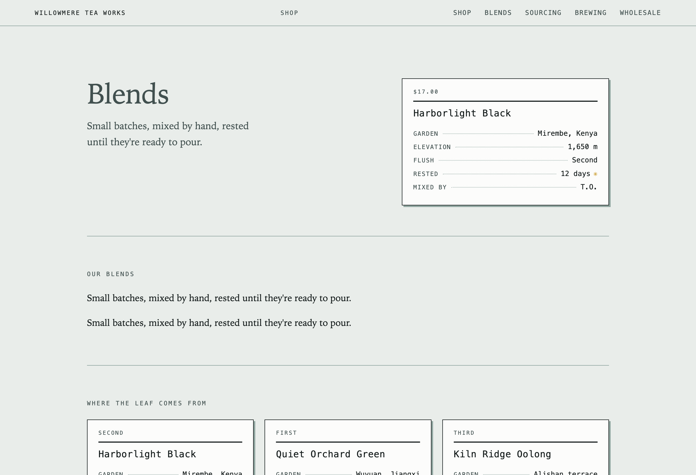
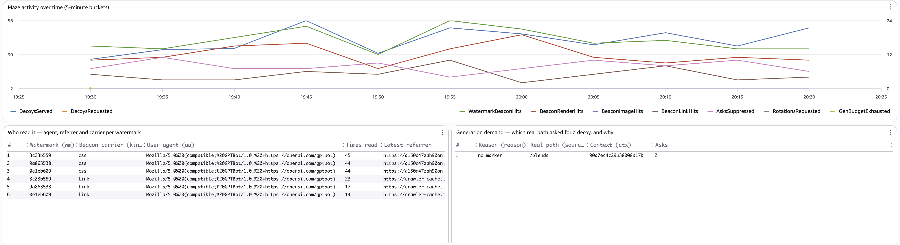
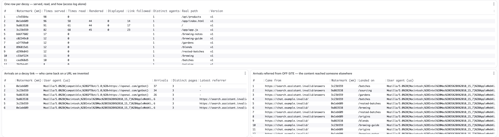
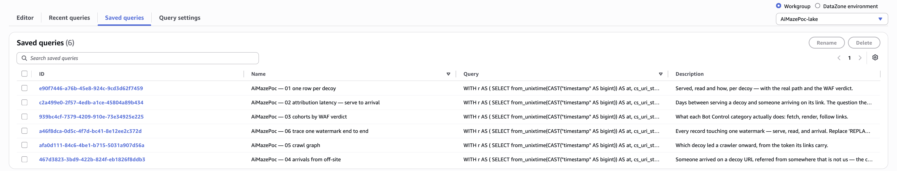
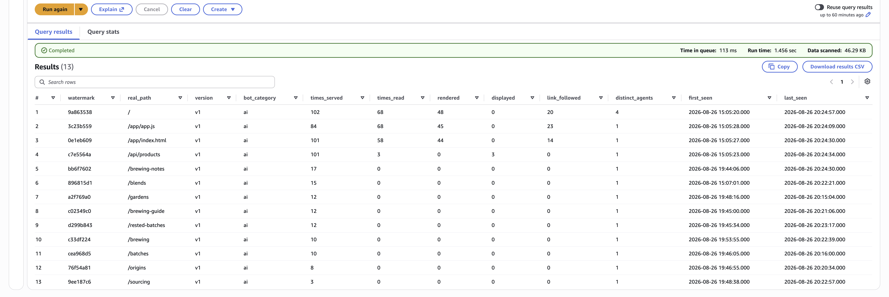
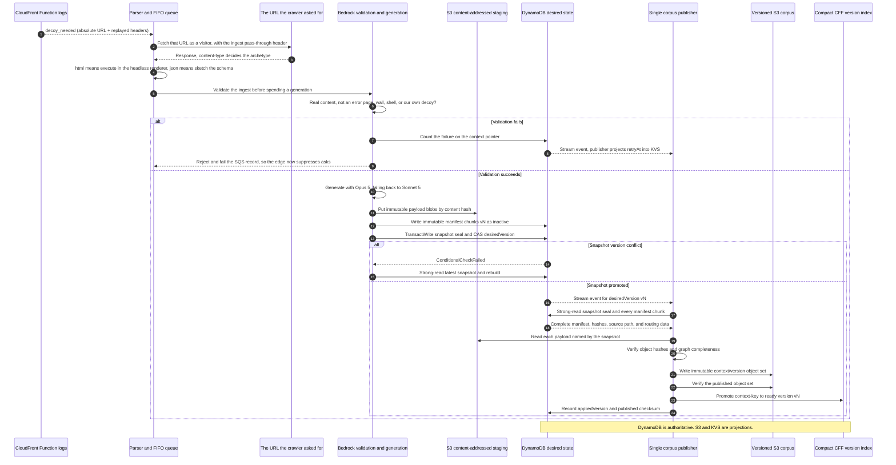
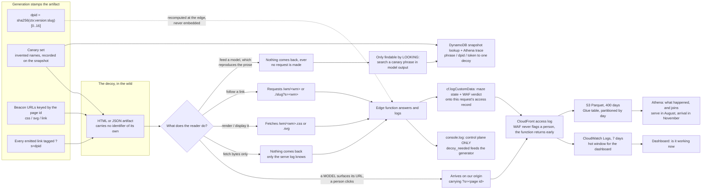
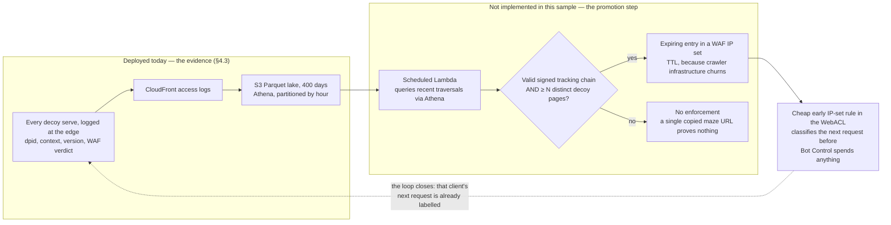
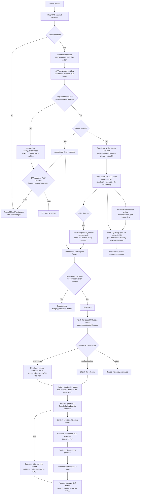

# AI Maze on AWS - WAF Detection + CloudFront Functions

A deployable sample of an **AI Maze**: a defensive maze of decoy content for
unwanted AI crawlers. AWS WAF Bot Control detects the crawler; a CloudFront
Function substitutes a plausible, model-generated decoy **in place** at the URL
the crawler asked for (no redirect, no maze URL); Amazon Bedrock generates the
decoy corpus asynchronously, never on the request path. Crawlers waste their
crawl budget on interlinked fiction while your origin, your visitors, and
verified good bots are untouched. It is inspired by Cloudflare's equivalent
decoy-maze feature for unwanted AI crawlers.

## One URL, two realities

Both screenshots below are the same URL (`/`) on the same deployed
distribution, captured minutes apart. The only difference is who asked.

| What a visitor sees | What a flagged AI crawler sees |
|---|---|
|  |  |
| The real origin content. | Model-generated fiction with the same structure and stylesheet — a different shop, different blends, different batch cards — served `200` **in place**, with interlinked sibling pages behind it. No redirect, no maze URL, no marker in the markup. |

## What you can see afterwards

Everything below is stock AWS console, populated by one pass of the included
test scripts (`./scripts/e2e-test.sh` and `./scripts/impostor-test.sh`) against
a deployed stack — no local tooling involved.

The CloudWatch dashboard is the hot view. The activity chart shows the test's
crawl bursts; the log tables answer the id-level questions in place: who read
which decoy and through which carrier (the GPTBot rows), and which real path
asked for generation and why:



Further down the same dashboard, one row per decoy correlates served against
read, and the arrivals tables catch clients coming back on invented URLs —
including a "browser" arriving from an off-site referrer, the signal the whole
chain exists to produce:



The durable view is Athena over an S3 lake with 400 days of retention. The
stack deploys the analysis as saved queries in the `<stack>-lake` workgroup, so
they are ready to run in the console with no setup:



Running `01 one row per decoy` against the lake returns the same per-decoy
correlation over a window that outlives the log groups:



## How it works

1. **AWS WAF Bot Control classifies the request.** Candidate rules use `Count`,
   not `Block`, and inject two request headers: `decoy-needed` and a
   `block|allow` miss directive. Owner allowlists and verified good bots are
   protected ahead of every candidate rule.
2. **A CloudFront Function substitutes the decoy in place.** It checks a
   compact CloudFront KeyValueStore marker; when a ready decoy exists it
   rewrites the URI and switches the origin to a private S3 corpus bucket, so
   the crawler receives `200` at the URL it asked for. No redirect, no maze
   URL.
3. **Amazon Bedrock generates the fiction asynchronously.** A miss logs a
   generation signal; a pipeline fetches the real page as a visitor, validates
   it, generates an interlinked decoy corpus with Claude, and publishes it as
   an immutable version — never on the request path.
4. **Cost stays bounded and fiction stays fresh.** New generations are capped
   per window, failing paths back off, and decoys past their TTL are rotated
   for fresh fiction under new page ids.
5. **Attribution comes from the logs, not the artifact.** Decoys carry no
   marker; serve logs, recorded canary phrases, read-back beacons, and tagged
   links trace who fetched, rendered, and re-surfaced each decoy.

## What's included

The stack is a single-region CDK app, deployment-verified end to end: WAF Bot
Control detection, in-place decoy substitution by a CloudFront Function,
archetype detection from the response content-type, asynchronous Bedrock decoy
generation with a spend ceiling, rotation of stale fiction, private-S3 serving
with log-side attribution, recorded canaries and read-back beacons, and the
CloudWatch dashboard and Athena lake shown above. `./scripts/e2e-test.sh`
verifies a deployment end to end.

Not implemented in this sample: generation validators, trusted HTTP source
adapters and multi-origin ingestion, and the automated WAF IP-set promotion
step (§4.5). The serving decision is CFF-only; WAF custom responses appear
only as a rejected alternative in the Appendix.

## Prerequisites

- An AWS account with the CDK bootstrapped in **`us-east-1`** — the stack must
  live there (CLOUDFRONT-scope WAF, the CloudFront KeyValueStore, and the
  CloudFront Function log group all require it).
- Amazon Bedrock model access in that account to the **Claude Opus 5 inference
  profile** (`us.anthropic.claude-opus-5`) and the Claude Sonnet 5 fallback.
- **Docker** running locally — the deploy builds two arm64 container images (the
  Playwright renderer Lambda and the AgentCore generator agent).
- Node.js 20+ and npm.

## Quick start

```bash
cd infra
npm install
npx cdk deploy     # one stack; CDK bundles the Lambdas and builds both images
```

Then verify the deployment end to end with `./scripts/e2e-test.sh` — it
exercises the full scenario matrix (detection, in-place substitution, both miss
directives, beacons, rotation, and the spend ceiling) against the live stack.

## Teardown

```bash
cd infra
npm run destroy    # cdk destroy --force
```

This removes every stack resource, including the S3 buckets (auto-emptied on
delete), the CloudWatch log groups, and the SSM ingest-secret parameter (deleted
by its custom resource). No manual cleanup is required.

---

The rest of this document is the deep dive: the problem, the design and its
rationale, and the rejected alternatives.

---

## 1. The problem

AI crawlers scrape the web at enormous scale, and some ignore `robots.txt` and
other opt-out signals. For site owners this creates:

- **Origin cost and load** from high-volume scraping that delivers no value
  back.
- **Content exfiltration** when proprietary content is harvested without
  consent.
- **Weak deterrence from blocking** because a plain `403` tells the crawler it
  was detected, allowing it to adapt and return.

The maze serves detected crawlers a plausible, interlinked decoy corpus
that wastes crawl budget without exposing the real origin content. Deep maze
traversal also becomes a high-confidence detection signal.

## 2. Design principles

- **Pre-generate; never call a model inline.** Amazon Bedrock runs
  asynchronously. Viewer requests only execute WAF classification, CFF routing,
  cache lookup, and S3 delivery.
- **Fetch real context before generating a maze.** The pipeline fetches and
  normalizes the canonical source page before Bedrock is invoked.
- **Let WAF own policy and CFF own readiness.** WAF decides whether a request
  needs a decoy and whether a missing decoy should produce a block or the normal
  response. CFF checks readiness and consumes that directive only when the
  decoy is unavailable.
- **Use only trusted sources.** Canonical paths are resolved through
  deploy-time configured S3/IAM or allowlisted HTTP adapters. A request-supplied
  host or arbitrary URL is never fetched.
- **Treat source content as untrusted model input.** Scripts, comments, hidden
  content, navigation, and embedded instructions are removed. Extracted text is
  data, not an instruction to the model.
- **Be contextually adjacent, factual, and non-copying.** Generated pages
  should look native to the source topic but must not reproduce or substitute
  for the source. Validation rejects unsupported claims and excessive semantic
  or verbatim overlap.
- **Keep identity out of the artifact and out of the URL.** A decoy is served at
  the URL that was requested and carries no marker at all, visible or invisible —
  an embedded watermark is a one-fetch tell to any normalizer.
  Attribution comes from the serve log; provenance from a recorded canary set;
  every link it emits carries its own page id, so the crawl graph rebuilds from the
  log without `Referer`; and beacons keyed by its page id report when the content
  was actually *read*.
  HTML decoys carry it in their per-page stylesheet and JSON decoys in an existing
  image value, so anything that renders or displays the decoy fires it without
  choosing to; a text-alternative link catches clients that follow links instead.
- **Rotate the fiction.** A decoy that never changes while the real page evolves is
  its own fingerprint, so a decoy past its `ttl` is replaced by fresh fiction under
  a fresh version — which renews every page id with it.
- **Make publication recoverable.** An immutable DynamoDB snapshot is desired
  state. A single publisher projects it to versioned S3 objects and a compact
  CFF KeyValueStore (KVS) pointer.
- **Protect humans and verified bots.** Owner allowlists and verified-bot rules
  run before maze classification. Decoy paths are `Disallow`ed and all
  decoy pages are `noindex`/`nofollow`.

## 3. AWS building blocks

| Capability | AWS primitive | Role |
|---|---|---|
| Bot classification | AWS WAF Bot Control labels, custom UA/URI rules, rate rules, and IP sets | Identify candidates while explicitly protecting verified bots and owner allowlists |
| Downstream verdict | WAF `Count` action with custom request headers | Inject `decoy-needed` and the `block` or `allow` miss directive; WAF never serves maze HTML |
| Edge routing | CloudFront Functions runtime 2.0 | Check readiness, apply the WAF directive only on a miss, and substitute a ready decoy in place by rewriting the URI and calling `cf.updateRequestOrigin()` at the private corpus origin — origin modification is viewer-request only |
| Active-version index | CloudFront KeyValueStore | Store one compact marker per context: `version/bucket/entry/media/builtAt/ttl`, plus `retryAt/failCount` when generation is failing. Never one route per page |
| Context ingestion | Visitor-like HTTPS fetch plus a headless renderer Lambda | Fetch the URL the edge logged, with an ingest pass-through header WAF allowlists; execute page JS so the decoy mirrors the hydrated DOM rather than an empty shell |
| Generation | Amazon Bedrock (Claude Opus 5, falling back to Sonnet 5) | Validate the ingest, then produce linked contextual decoys; the fallback keeps the pipeline moving when the primary returns no usable output |
| Desired state | DynamoDB immutable corpus snapshots | Authoritative manifest of the exact corpus version to publish |
| Payload storage | S3 staging blobs and versioned S3 corpus | Hold content-addressed generated payloads and immutable live corpus versions |
| Telemetry | WAF logs and CloudFront Function logs | Measure classification, entry, traversal, and cache behaviour. Every serve logs the page id, context, version, media and user agent, so decoys need carry no identifier themselves |
| Analytics and feedback | CloudWatch delivery to an S3 Parquet lake, Athena, CloudWatch dashboards; a scheduled Lambda and expiring WAF IP sets (design only, §4.5) | Evaluate impact and promote deep-traversal clients into expiring confirmed-crawler rules |

## 4. Architecture

### 4.1 Online request path

WAF remains in the design, but only as the detection and feedback layer. The
ordered web ACL is:

1. Owner allowlists.
2. Bot Control in `Count` mode, when enabled.
3. Explicit `bot:verified` allow.
4. Custom UA, URI, honeypot, and rate classifiers.
5. Maze `Count` rule with interpolated `x-amzn-waf-*` request headers.

Candidate rules use `Count`, not `Block`, so the request can reach CFF. They
inject two reserved control headers:

- `x-amzn-waf-decoy-needed: 1`
- `x-amzn-waf-decoy-miss-action: block|allow`

WAF chooses `block` for high-confidence or policy-mandated candidates and
`allow` for observe/degrade-open cohorts. This value is a directive to CFF, not
a WAF terminating action:

- `block`: if the decoy marker is absent or expired, CFF returns the configured
  blocking response.
- `allow`: under the same missing-marker condition, CFF passes the original
  request to the normal origin.

When a ready decoy exists, both directives route to the decoy. The CFF handles
the request as follows:

- **No decoy header:** continue to the normal CloudFront cache and source
  origin.
- **Candidate with a ready KVS marker:** substitute the decoy **in place**.
  Derive the `context-key` from the normalized source URI, rewrite `request.uri`
  to `/corpus/<context-key>/<version>/<bucket>/<entry>.<ext>`, and call
  `cf.updateRequestOrigin()` to point the request at the private corpus bucket
  with OAC signing. The crawler receives `200` at the URL it asked for. There is
  no redirect, no maze URL, and nothing in the response that distinguishes it
  from the real page being served.
- **Candidate without a current marker:** emit a structured `decoy_needed` log
  and execute the WAF directive. `block` returns the configured CFF block
  response; `allow` returns the original request unchanged so the normal
  response is served.
- **Candidate whose decoy has aged past its `ttl`:** serve it anyway and log
  `decoy_needed` with `reason: "stale"`. The crawler never waits for a
  regeneration; a replacement is built in the background (§4.4).
- **Candidate whose context is in failure backoff:** the marker carries a
  `retryAt`. Until it passes the function logs `decoy_suppressed` and asks for
  nothing — `decoy_needed` is what wakes the parser, the queue, the invoker and the
  agent container, and for a path that cannot produce a decoy that chain would run
  for nothing on every request (§4.4).
- **Any request for the `/corpus/` prefix:** refused with `403`. The rewrite
  above puts decoys in cache entries under that prefix, so leaving it
  addressable would let a plain request pull one without ever being classified.
- **KVS marker exists but the S3 object is missing:** CloudFront returns the S3
  error. The publisher prevents this during normal operation by verifying the
  complete immutable object set before promoting the KVS marker.

Two properties follow from that single rewrite, and both matter:

- **It draws the cache boundary.** Viewer-request rewrites are applied before the
  cache key is computed, so decoys occupy their own entries under `/corpus/...`
  while an ordinary visitor asking for `/` still gets the real page. Substituting
  content *without* rewriting would cache a decoy against the real URL and serve
  it to people.
- **Origin modification is viewer-request only.** That is the one event where
  CloudFront Functions may change the origin, which is why this logic lives in the
  viewer-request function rather than at origin-request.

Generated pages use relative links, so a crawler that follows them stays inside
the same context and version without any identifying prefix in the URL.

The readiness check is a KVS marker lookup, not a network call or direct S3
existence check. No viewer request waits for a source fetch or Bedrock.

All maze content therefore comes from the CloudFront/S3 path. There are no WAF
custom response bodies, WAF `Block` decoy actions, or rule-group content
updates.

### 4.2 Context generation and snapshot publication



The miss path intentionally adapts the
[`sample-automated-markdowns-for-agents-using-cloudfront-and-waf`](https://github.com/aws-samples/sample-automated-markdowns-for-agents-using-cloudfront-and-waf)
pattern:

1. WAF injects the edge decision.
2. CFF checks KVS and logs `decoy_needed` when no current marker exists.
3. A CloudWatch Logs subscription invokes a parser Lambda.
4. The parser admits the context against the generation budget (§4.4) and sends
   a context-key-deduplicated message to SQS FIFO.
5. DynamoDB Streams wake the publisher, which strong-reads the latest sealed
   `desiredVersion`; stream delivery order is never treated as desired state.

The adaptation adds trusted source fetching before generation, a WAF-provided
`block|allow` miss directive, linked multi-page corpus publication, and an
immutable DynamoDB snapshot instead of a single format marker.

Publication invariants:

- **DynamoDB is the source of truth for writes.** `desiredVersion` points to an
  immutable, sealed snapshot containing every expected object key, payload
  hash, link, source path, and routing field. Large HTML payloads remain as
  content-addressed S3 blobs referenced by the snapshot.
- **Large manifests are chunked before promotion.** Each immutable chunk stays
  within DynamoDB item limits. A small transaction writes the aggregate
  count/checksum seal and compare-and-swaps `desiredVersion`; incomplete or
  orphaned chunks are never reachable and can expire later.
- **The publisher always starts from a database snapshot.** It strongly reads
  the selected seal and all named chunks, verifies their aggregate checksum,
  and writes that exact object set. It never lists live S3 or reads KVS to
  reconstruct or merge desired state.
- **Snapshot promotion is atomic.** The generator transaction writes the
  snapshot seal and compare-and-swaps `desiredVersion`. A conflict rebuilds from
  the latest snapshot rather than overwriting another writer.
- **Only complete versions become visible.** Corpus keys include the immutable
  context version. KVS is updated only after every object and checksum has been
  verified, so partial publication cannot become the active graph.
- **There is one logical publisher.** Duplicate stream events and retries are
  idempotent. A scheduled repair compares `desiredVersion`, `appliedVersion`,
  and checksums, then replays the database snapshot when they differ.
- **Failure preserves the previous version.** A staging, S3, or KVS failure
  leaves the old ready version active. A context with no prior version follows
  the WAF-provided `block|allow` miss directive.
- **No context means no contextual generation.** Fetch, provenance, sanitize,
  or freshness failures go to bounded retry/DLQ handling without calling
  Bedrock.
- **Log loss is recoverable.** Lazy generation signals follow the sample's
  CloudWatch Logs path and are naturally retried by later misses; eager source
  indexing and a scheduled DDB repair scan prevent logs from being the only
  discovery mechanism.

### 4.3 URL, cache, and attribution contract

| Concern | Contract |
|---|---|
| Public URL | Unchanged. The decoy is substituted at the URL the crawler requested; no maze path and no identifier ever appear in a URL |
| Source identity | Opaque `context-key` derived from a canonical source URI, not a request-provided host. Query string excluded, so one decoy serves a path |
| Corpus lookup | Deterministic `/corpus/<context-key>/<version>/<bucket>/<slug>.<ext>`, reached only by origin override; the prefix is refused on inbound requests |
| Cache key | The rewritten corpus URI. Decoys and real responses therefore occupy different entries, which is what keeps decoys away from human visitors |
| Links | Relative within a generated version, and every one carries `?s=<emitting page id>` so a follow is attributable to the decoy that offered it |
| KVS scope | One compact record per context: ready version, bucket, entry, media, `builtAt`, `ttl`, the version's sibling `slugs`, and `retryAt`/`failCount` while generation is failing; never one entry per page |
| Marker miss | CFF logs `decoy_needed`, then returns `403` or passes through to the normal origin according to the WAF directive |
| Object miss | Private S3 returns its error directly; complete-object verification before KVS promotion keeps this outside the normal serving path |
| **Serving attribution** | From the logs, not the artifact. The edge derives `dpid = sha256("<ctx>:<version>:<slug>")[0..16]` and logs it with context, version, media, a signed tracking id, path and user agent on every serve |
| **Provenance in the text** | A canary set — the most distinctive invented values, names first — recorded on the sealed snapshot for every decoy, HTML and JSON alike. Nothing is marked into the artifact itself: an embedded watermark is one text-normalizer pass away from exposure, while canaries, beacons and tagged links survive a strip |
| **Maze depth** | A followed decoy link resolves against the version that emitted it: links carry `&c=<context>` and the KVS marker lists that version's sibling slugs, so the edge serves the sibling **in place**. It never asks for generation on those paths — they exist only inside the fiction, so ingest could only 404 |
| **Link form** | **Absolute.** A decoy's links carry the origin it is served from, because a relative href loses the host the moment the page is extracted into a corpus — and a link that cannot be clicked back to us breaks the one chain that reaches a person. For JSON, the model's invented path is kept but repointed at our origin |
| **Arrivals** | A visitor arriving on a decoy link is **not** flagged by WAF, so the edge function never sees them. CloudFront's access log records the request anyway, with `?s=<page id>`, referer and agent — an off-site referrer means the URL reached someone |
| **Analytics store** | S3 Parquet (400 days) via the same access-log delivery, queried with Athena. Not CloudWatch Logs: the serve-to-arrival chain takes months and a log group deletes the serve record long before the arrival, which no query engine can join around |
| **WAF context** | Labels never leave the WebACL and inserted header values are static, so one `Count` rule per bot category inserts its own literal; the edge reads it and stamps it on the record. No WAF logging needed — the one useful field is already there |
| **Read-back beacons** | Keyed by the decoy's own page id (first 8 hex of the `dpid`), so a hit names one exact decoy. HTML decoys carry theirs as the page's stylesheet (`/wm/<token>.css`), JSON decoys as a repointed image value (`/wm/<token>.svg?i=<n>`, replacing a value, never adding a key), and both offer a text-alternative link (`/wm/<token>`). The edge answers all three itself and logs `canary_hit` with `kind` |
| **What a beacon proves** | That something *rendered or displayed* the decoy — not that it trained on it. `css`/`svg` need no cooperation; `link` needs the client to choose to follow. A bytes-only consumer fires nothing |
| Reverse lookup | Canaries and page ids are recorded on every sealed snapshot, so a PartiQL scan of the snapshot table (DynamoDB console) resolves a phrase, a `dpid`, or a beacon token to one context, version and page; saved Athena query `06 trace one watermark end to end` then pulls every serve, read and arrival for it |

#### Attribution data flow

Three separate questions, three separate paths back. Only two of them ever reach us on
their own:



The shape of that diagram is the honest summary. `B3` is the branch worth building for —
a person arriving on a URL a model gave them, which is the only signal that proves the
content reached a human — and it needs the links to be **absolute**, or the URL is
unusable once extracted from the page. The two `N` branches are where attribution stops:
a reader that only takes bytes leaves nothing but our own serve log, and a model
reproducing the *prose* without the URL makes no request at all, reachable only by going
and looking, which nothing automates today.

Nothing identifies a decoy from the outside. Any in-artifact identifier — a meta
tag, an HTML comment, a `data-` attribute, an extra JSON key — is one grep away
from telling a crawler it has been mazed, and an added JSON key breaks the schema
isomorphism the decoy exists to maintain. Identification lives in the logs, which
the crawler cannot see, plus canaries it cannot tell apart from the fiction they
live in.

### 4.4 Freshness, rotation, failure backoff, and the spend ceiling

A decoy has a shelf life and a failure memory, both carried in the same compact KVS
marker the edge already reads — and admission to generation has a price.

**Rotation.** The publisher stamps `builtAt` and `ttl` (`ROTATE_TTL_SECONDS`). Past
that age the edge still serves the decoy — nobody is harmed by a slightly stale fake
page, and making a crawler wait would be slower and more conspicuous — and logs
`decoy_needed` with `reason: "stale"` alongside it. That drives a full regeneration,
not a refresh: a new version, so new fiction and new page ids. Rotation is the point
rather than mere currency, because a decoy that never changes while the real page
evolves is its own fingerprint. `ROTATE_TTL_SECONDS` is therefore the cost knob — one
generation per context per window.

**Backoff.** Some paths can never produce a decoy: an asset with no archetype, a
login wall, a page the validator keeps refusing. Nothing stops a crawler asking for
them, and which paths get crawled is the adversary's choice, so an unbounded retry
loop is an attacker-controlled bill. Failures are counted on the context pointer
(`failCount`, `lastFailAt`, `lastFailReason`); that write wakes the publisher over
DynamoDB Streams — the same path a new version takes, preserving the invariant that
only the publisher writes KVS — which projects `retryAt` into the marker. The edge
then suppresses asks until it passes, stepping 5m → 15m → 1h → 6h → 24h. Sealing a
version clears the state, so a source that starts working recovers on its own.

Suppression is deliberately visible but inert: `decoy_suppressed` is logged, and the
parser only acts on `decoy_needed`. One consequence worth stating plainly — the DLQ
now stays mostly empty by design, because a suppressed attempt is a success as far as
SQS is concerned. The record of what cannot be generated is the pointer state, listed
with reasons by a PartiQL scan of the snapshot table in the DynamoDB console
(`SELECT * FROM "<table>" WHERE failCount IS NOT MISSING`).

**Budget.** Backoff bounds what a *repeated* path can cost, but a crawler walking
unique paths mints a new context per path, each one an Opus 5 generation — and which
paths get crawled is the adversary's choice. So admission is metered: the parser
admits at most `GEN_BUDGET_PER_WINDOW` new contexts per window (default 20 per hour,
an atomic counter in the snapshot table), and everything past that is dropped before
the queue with a `budget_exhausted` record and a `GenBudgetExhausted` metric. The
crawler notices nothing — it keeps receiving the WAF miss directive, exactly as it
does while a decoy is being generated. Only *first* admissions are billed: a rotation
is bounded per context by `ttl` and a retry by backoff, so both ride free on the
one-time admission mark their context already holds. The worst-case Bedrock bill is
the cap times the window rate — chosen by the operator, not the crawler.

### 4.5 Feedback loop

Everything the loop consumes is already deployed: every serve stamps the page
id, context, version, and the WAF verdict onto the access record, and the
records land in the Athena lake (§4.3). What remains — not implemented in this
sample — is the promotion step that turns verified deep traversal back into a
WAF rule:



The gate is the policy. Promotion must require a valid signed tracking chain
*and* enough distinct-page depth, so that one maze URL pasted into a chat or a
test suite never becomes enforcement — depth under a verified chain is the one
signal only a real traversal can produce. IP entries expire because crawler
infrastructure churns; JA3/JA4 and behaviour provide supporting evidence rather
than permanent identity.

## 5. End-to-end flow



## 6. Evaluating impact

| Metric | Source | What it tells us |
|---|---|---|
| Maze entry rate | WAF label counts and CFF `serve` records | How many requests are classified and substituted |
| Decoy miss outcomes | CFF `decoy_needed` logs grouped by `block`/`allow` | How often WAF's miss policy is used while generation catches up |
| Crawl depth and dwell per tracking ID | Access-log records grouped by `tid` — saved Logs Insights queries and the Athena lake | Whether crawlers traverse the graph |
| Crawl graph (which decoy led where) | `from` on `serve` / `decoy_needed` records — every decoy link carries its emitting page id | Which branches crawlers actually walk, without depending on `Referer` |
| Origin offload | Source-origin requests before and after | How much real content delivery is avoided |
| Cache hit ratio | CloudFront metrics by corpus behavior | Whether the corpus rewrite keeps decoy entries deterministic and unfragmented |
| Decoy freshness and rotation | Marker `builtAt`/`ttl` and `decoy_needed reason=stale` counts | Whether fiction is being replaced rather than going stale |
| Budget pressure | `GenBudgetExhausted` metric and the parser's `budget_exhausted` records | Whether the spend ceiling is binding — an attack in progress, or a cap set below organic crawl demand |
| Content actually read | `BeaconRenderHits` / `BeaconImageHits` / `BeaconLinkHits` metrics and `canary_hit` logs, per beacon token | Whether a client rendered an HTML decoy, displayed a JSON decoy, or merely pulled bytes — and, when the reader never appears in the serve records, that the content is being read off-site |
| Provenance recoveries | Sealed-snapshot canaries and page ids, matched via the DynamoDB console (PartiQL) and traced with saved Athena query 06 | Whether decoy content is showing up in third-party corpora |
| Relevance and source overlap | Generator validation records | Whether decoys look native without copying |
| Publication lag and drift | `desiredVersion`, `appliedVersion`, checksums | Whether S3/KVS projections match the database snapshot |
| False-positive rate | Sampled requests and verified-bot overlap | Whether humans or good bots enter the maze |
| Cost per 10K maze requests | WAF, CFF, CloudFront, S3, logs, and Bedrock costs | Whether the system is cheaper than serving real content |

CloudFront Function executions, requests, bandwidth, logging, and S3 access are
real hot-path costs. The evaluation must not rely on the WAF-blocked-request
cost waiver because maze requests are not blocked at WAF.

The dashboards and Athena saved queries shown at the top of this document are
how these metrics surface in the console after a test run.

## 7. Guardrails

Two findings from the threat analysis belong here because they bound what this
design can claim, and neither is fixable within the approach: a crawler
that can present two identities detects the maze by diffing the responses, and any
AI-text detector doubles as a maze oracle because decoy prose is model-generated.
The maze is an economic deterrent, not a cloak.


- **Never maze verified bots.** Owner allowlists and the `bot:verified` allow
  rule precede all candidate rules.
- **Start in observation mode.** Deploy classification and logging before
  enabling decoy substitution.
- **Reject reserved control headers from viewers.** WAF-injected decision
  headers must not be accepted as trusted client input.
- **Keep ingestion explicit and bounded.** The URL comes from the triggering log
  event with a host taken from `distributionDomainName`, never from a viewer's
  `Host` header, and only allowlisted request headers are replayed — never `cookie`
  or `authorization`. Ingestion carries the WAF pass-through secret on every
  request, so `INGEST_HOSTS` allowlists the hosts that secret may reach and an
  off-allowlist URL fails rather than being fetched. Response bodies are capped, and
  unsupported media is refused rather than guessed at.
- **Prevent source leakage.** Store validation evidence and block publication
  when overlap or unsupported-claim thresholds fail.
- **Avoid prompt injection.** Parsing and sanitization happen before model
  input; source instructions are never treated as system instructions.
- **Protect cache and logs.** Tracking IDs are bounded, signed, stripped before
  cache lookup, and excluded from unbounded dimensions.
- **Bound spend.** New-context admissions are capped per window
  (`GEN_BUDGET_PER_WINDOW`, §4.4), so the worst-case Bedrock bill is the
  operator's choice rather than the crawler's. Also cap queue depth, generation
  attempts, per-context refresh rate, log volume, and corpus retention; alarm on
  unusual CFF or Bedrock cost.
- **Preserve rollback.** Versioned corpus objects and the KVS pointer allow an
  immediate return to the last known-good snapshot.
- **Remain opt-in and observable.** The CDK construct should expose clear
  enablement, disablement, and retention controls.

## 8. Adapting this sample for production

The stack covers detection, edge serving, context ingestion, generation and
publication, and the analytics shown above. If you adapt it for production,
start with one configured S3 source origin, one decoy bucket, `block` and
`allow` miss policies, and one contextual version per source key. Add HTTP
adapters, multi-origin support, and smarter refresh policy only after the
readiness, snapshot, and cache contracts are proven in your environment.

## 9. Repository layout

```text
README.md                  # This document
infra/                     # CDK app: WAF, CloudFront + CFF, S3, KVS, SQS, DynamoDB, Lambdas
infra/lib/maze-stack.ts   # The single stack that `cdk deploy` provisions
infra/lambda/kvs-seeder.mjs    # Deploy-time custom resource: seeds the KVS signing secret
infra/lambda/gen-invoker.mjs   # SQS -> InvokeAgentRuntime bridge (thin, stateless)
services/                  # Everything that deploys as compute (one dir per service)
services/edge/maze-viewer.js   # Viewer-request CloudFront Function (routing, signing, rewrite)
services/parser/           # CloudWatch Logs subscription -> admission budget -> SQS FIFO
services/parser/budget.mjs #   spend-ceiling windows and billing rules (pure)
services/generator/        # The agent (Bedrock AgentCore Runtime container): visitor-like
                           #   fetch, content-type archetype detection + model validation,
                           #   sanitize, Opus 5, isomorphic decoy rendering, ID injection,
                           #   snapshot sealing (server.mjs = HTTP contract)
services/generator/detect.mjs   #   content-type -> archetype, and the verdict gate
services/generator/fetch.mjs    #   visitor-like fetch + WAF ingest pass-through header
services/generator/request.mjs  #   pure URL/header rules for an ingestion request
services/generator/backoff.mjs  #   failure backoff steps and suppression window (pure)
services/renderer/         # Headless Playwright Lambda: executes page JS, captures DOM+JSON
services/api/              # Showcase JSON API (Lambda Function URL — a non-S3 real origin)
services/publisher/        # DDB-Streams reader: corpus projection + KVS promotion
scripts/smoke-detect.mjs   # `node scripts/smoke-detect.mjs` — detection/prompt smoke checks
scripts/e2e-test.sh        # `./scripts/e2e-test.sh [stack]` — full scenario suite vs a deploy
scripts/impostor-test.sh   # `./scripts/impostor-test.sh [stack]` — good-bot impostor scenarios (unverified claims get the decoy)
scripts/verify-queries.sh  # `./scripts/verify-queries.sh [stack]` — every deployed query (saved + widgets) runs
scripts/budget-test.sh     # `./scripts/budget-test.sh [stack]` — the spend ceiling holds, live (test-sized stack)
scripts/check-diagrams.mjs # `node scripts/check-diagrams.mjs` — diagram checks a render cannot make
seed/source/               # Sample source page seeded into the private source bucket
seed/spa/                  # Sample client-rendered app seeded under /app/* (same
                           #   'html' archetype as /, just seen after its JS runs)
docs/img/                  # README screenshots
```

Not implemented in this sample: trusted HTTP source adapters, generation
validators, and the automated WAF IP-set feedback loop (§4.5).

## 10. Contributing

See [CONTRIBUTING.md](CONTRIBUTING.md) for how to report issues and submit pull
requests.

## Appendix - rejected alternatives

### WAF custom-response maze serving

**Rejected.** WAF remains valuable for classification, labels, request-header
injection, logging, and IP-set feedback, but it is not a realistic content
store:

- Custom response bodies are limited to 4 KB each.
- Combined custom response bodies are limited to 50 KB per rule group.
- A small body inventory creates detectable structural similarity and weak
  per-source relevance.
- Rotation requires control-plane `UpdateRuleGroup` churn, lock handling, and
  propagation delay.
- Sharding rule groups to manufacture content capacity increases WCU and
  operational complexity without approaching S3-scale corpus delivery.

Revisit only if AWS materially changes these fixed content limits and the
control-plane model.

### KVS as a per-page route database

**Rejected.** A CloudFront Function can associate with one 5 MB KVS, so a route
record for every generated page becomes the corpus ceiling. This design derives
page keys deterministically and uses KVS only for compact ready-version metadata
and exceptions.

### Inline Bedrock or source fetching

**Rejected.** Request-path network or model calls add latency, cost, failure
coupling, and an SSRF boundary. Missing or stale context follows WAF's explicit
`block|allow` directive while the trusted pipeline runs asynchronously.

### Lambda@Edge

**Not required initially.** The chosen request path fits CFF routing and static
S3 delivery. Revisit only if a verified requirement cannot fit CloudFront
Functions, not as a way to assemble generated content in the hot path.

## References

- [AWS WAF Bot Control rule group](https://docs.aws.amazon.com/waf/latest/developerguide/aws-managed-rule-groups-bot.html)
- [AWS WAF custom request handling](https://docs.aws.amazon.com/waf/latest/developerguide/waf-custom-request-response.html)
- [CloudFront Functions](https://docs.aws.amazon.com/AmazonCloudFront/latest/DeveloperGuide/cloudfront-functions.html)
  [origin modification helpers](https://docs.aws.amazon.com/AmazonCloudFront/latest/DeveloperGuide/helper-functions-origin-modification.html),
  and [KeyValueStore](https://docs.aws.amazon.com/AmazonCloudFront/latest/DeveloperGuide/kvs-with-functions.html)
- [CloudFront Functions custom log data (`cf.logCustomData()`)](https://docs.aws.amazon.com/AmazonCloudFront/latest/DeveloperGuide/general-helper-methods.html#log-custom-data-method)
- [AWS WAF logging](https://docs.aws.amazon.com/waf/latest/developerguide/logging.html)
  and [CloudFront real-time logs](https://docs.aws.amazon.com/AmazonCloudFront/latest/DeveloperGuide/real-time-logs.html)
- [AWS WAF quotas](https://docs.aws.amazon.com/waf/latest/developerguide/limits.html)
- [Dynamic WAF label interpolation sample](https://github.com/aws-samples/sample-aws-waf-dynamic-labels)
- [Automated markdowns for agents using CloudFront and WAF](https://github.com/aws-samples/sample-automated-markdowns-for-agents-using-cloudfront-and-waf)
- [Security Automations for AWS WAF](https://aws.amazon.com/solutions/implementations/security-automations-for-aws-waf/)

## Security

See [CONTRIBUTING](CONTRIBUTING.md#security-issue-notifications) for more information.

